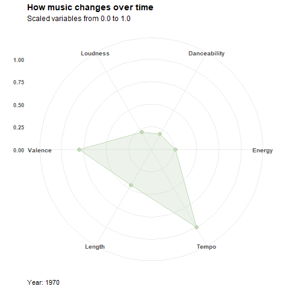

```{r setup, include=FALSE}
knitr::opts_chunk$set(echo = TRUE)
```

```{r, echo=FALSE, message= FALSE}
library(tidyverse)
library(data.table)
library(ggplot2)
library(ggridges)
library(ggiraphExtra)
library(gganimate)
library(scales)
library(DataExplorer)

theme_set(theme_minimal()) # set global theme for ggplot
```

## Reading the data from TidyTuesdays, and exploring.

```{r, echo=TRUE, message=TRUE}
spotify_songs <- readr::read_csv('https://raw.githubusercontent.com/rfordatascience/tidytuesday/master/data/2020/2020-01-21/spotify_songs.csv')

tail(spotify_songs)
#typeof(spotify_songs)
spotify_songs <- as.data.table(spotify_songs)

```

Here we see the distributions of genres and subgenres...

```{r}
DataExplorer::plot_bar(spotify_songs)
```

Here we can see the Boxplots by Tempo.

```{r}
DataExplorer::plot_boxplot(spotify_songs, by = "tempo")
```

```{r, echo = TRUE}
skimr::skim(spotify_songs)
```

After skimming the data we can say we have a nice distribution of numeric and character type variables. 

It was interesting to find the variable *danceability* as a value to determine how danceable is a song from 0.0 to 1.0, and how the mean tends to be positive!
*Energy* was also positive. 

There are some rows with long album names, songs and playlist. 

We may convert *key* to factor! Since they are values resembling the overall key of a track. 

```{r, echo = TRUE}
unique(spotify_songs$key)

#spotify_songs$key <- as.factor(spotify_songs$key)

# Dropping NA values. 5 occurrences, no need to keep!
spotify_songs <- spotify_songs[!(is.na(track_name) & is.na(track_artist) & is.na(track_album_name))]

nrow(spotify_songs) - length(unique(spotify_songs$track_name))

toprepeated <- head(spotify_songs[, .(count = .N), by = track_id][count > 1][order(-count)])

topsongsrepeated <- spotify_songs[track_id %in% c(toprepeated$track_id), c('track_name', 'track_artist', 'track_album_name', 'playlist_name', 'playlist_id')][order(track_artist)]

unique(topsongsrepeated$track_artist)


```

It also seems that there are repeating songs, since there are only 23449 unique values out of 32828 (not including the 5 NAs).

The artists that have repeated songs are Kygo, Riton, The Chainsmokers and Travis Scott, the same song appears in different playlists.
Kygo even has two songs that are commonly added to playlists!

Now... about the long lengths... we can notice in the output of the playlist names of the repeated songs that there are some strange symbols that make the length go bigger than expected. Let's check them in depth.

```{r, echo = TRUE}
spotify_songs[nchar(playlist_name)>100][,.N, by = playlist_name]
nrow(spotify_songs[nchar(playlist_name)>80][,.N, by = playlist_name][order((-N))])
nrow(spotify_songs[nchar(playlist_name)>50][,.N, by = playlist_name][order((-N))])

```

It seems there are really specific playlists! There was only one playlist over the 100 characters, and it was specifying it includes more than 7 genres, plus the previously stated U codes. There were 12 playlists over the 80 characters, and 33 playlists over the 50 characters.

Lets explore the different *valence* by genres. If the value that corresponds to valence is actually the musical positiveness conveyed by a track from a low score (0.0) to a high score (1.0).

```{r, warning =FALSE, message = FALSE}
ggplot(
  spotify_songs,
  aes(x = valence, y = playlist_subgenre, fill = playlist_genre),
) +
  ggridges::geom_density_ridges(
    show.legend = FALSE,
    panel_scaling = FALSE,
    quantile_lines = TRUE,
    quantiles = c(.05, .95),
    alpha = .7
  ) +
  facet_wrap(~playlist_genre, scales = "free_y") +
  scale_x_continuous(limits = c(0, 1)) +
  ggridges::theme_ridges() +
  labs(
    y = "Genres & Sub-genres",
    x = "Valence"
  ) +
    theme(text = element_text(size=20),
        axis.text.x = element_text(angle=90, hjust=1)) 


```

Tracking distribution of length over time. First we transform to date format...

```{r, warning= FALSE}

spotify_songs$track_album_release_date = as.Date(spotify_songs$track_album_release_date)

ggplot(spotify_songs, aes(x = track_album_release_date, 
                            y = duration_ms / 60000)) +
  geom_point(aes(color = playlist_genre), alpha = 0.3) + 
  geom_smooth() +
  facet_wrap(~playlist_genre) +
  labs(x = "Track Release Date",
       y = "Song Length (min)",
       title = "Length of Songs by Genre") +
    theme(text = element_text(size=14),
        axis.text.x = element_text(angle=90, hjust=1),
        legend.position = "none") 


```

Unfortunately, in general we have smaller lengths in the present.

```{r, include= FALSE}
df <- spotify_songs %>%
  select(track_album_release_date, danceability:duration_ms) %>%
  mutate(year = as.integer(substr(track_album_release_date, 0, 4)),
         danceability = rescale(danceability),
         energy = rescale(energy),
         tempo = rescale(tempo),
         valence = rescale(valence),
         loudness = rescale(loudness),
         duration = rescale(duration_ms))
plotdf <- df %>% 
  filter(year >= 1970) %>%
  group_by(year) %>%
  summarise(Danceability = mean(danceability),
            Energy = mean(energy),
            Tempo = mean(tempo),
            Length = mean(duration),
            Valence = mean(valence),
            Loudness = mean(loudness))
```

Upon finding ggradar:

```{r, eval = FALSE}
ggRadar(data = plotdf, aes(group = year), size = 3, ylim = 1.1) +
  scale_color_gradient(low="#C1D8B9", high="#C1D8B9") + scale_fill_gradient(low="#C1D8B9", high="#C1D8B9") +
  theme(legend.position = "none",
        plot.title = element_text(face="bold", size=14),
        plot.subtitle = element_text(size=12),
        axis.text.y = element_text(face="bold"),
        axis.text.x = element_text(face="bold", size = 10),
        axis.title.x = element_text(hjust = 0),
        axis.title.y = element_blank()) +
  labs(title = "How music changes over time",
       subtitle = "Scaled variables from 0.0 to 1.0",
       x = "Year: {frame_time}") +
  transition_time(year) + shadow_mark(alpha=0.1, size=0.5, colour = "grey", fill = "#FFFFFF")

anim_save(filename= "radarchangesovertime.gif", animation = last_animation())

```



Recently songs have trended less energetic, sader, louder, more danceable, and faster.

```{r}
spotify_songs2 <- spotify_songs %>% mutate(playlist_subgenre = fct_reorder(playlist_subgenre, track_popularity))
levels(spotify_songs2$playlist_subgenre) <- gsub(" ", "\n", levels(spotify_songs2$playlist_subgenre))

ggplot(spotify_songs2, aes(y=track_popularity, x=playlist_subgenre, 
                          fill = playlist_genre)) + geom_boxplot() +
  #theme(axis.text=element_text(margin = margin(0,1,1,0), angle = 90, hjust = 1)) + 
  facet_wrap(~playlist_genre, scales = "free_y") + coord_flip() +
  labs(title = "Popularity of each subgenre",
       y = "Popularity",
       x = "") +
  theme(text = element_text(size=10),
  axis.text.x = element_text(angle=45, hjust=1),
  legend.position = "none") 
```

And last but not least, a boxplot showing the popularity of each subgenre.

```{r, echo= FALSE, include = FALSE}
#temp_songs <- spotify_songs %>%
#  mutate(year = as.integer(substr(track_album_release_date, 0, 4))) %>%
#  filter(year >= 1990 & playlist_genre %in% c('latin', 'rock', 'r&b')) %>%
#  group_by(year) %>%
#  mutate(mean_tempo = mean(tempo))


#ggplot(
#  temp_songs,
#  aes(year, mean_tempo, group = playlist_genre, color = factor(playlist_genre))
#  ) +
#  geom_line() +
#  scale_color_viridis_d() +
#  labs(x = "Day of Month", y = "Temperature") +
#  theme(legend.position = "top") + 
 # geom_point() +
#  transition_reveal(year)
```